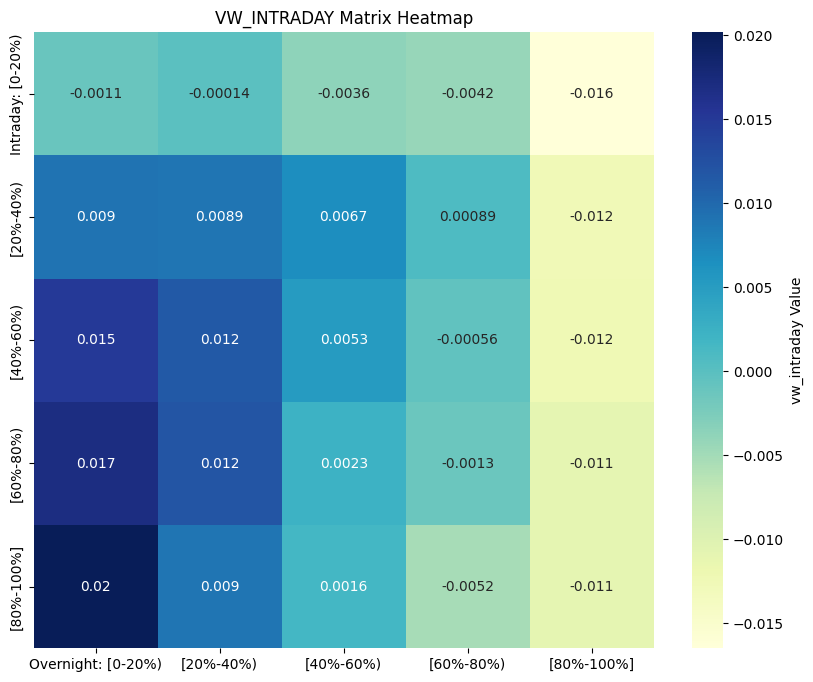

# PS2

| Student ID | Name |
| --- | --- |
| 3035707932 | Liu Man Siu |
| 3036357332 | YU HAOYANG |
| 3036354110 | Han Huiyang |
| 3036360494 | Ma Kunmao |

## GitHub of this project

To make the code review process much more convenient, we have adopted GitHub for our project management, where we've established branch management and put the pull request system into practice. The repository address is: [https://github.com/hanhy/7037](https://github.com/hanhy/7037). This is the details of the pull requests in our project in a week.

## Q1

Earnings of companies are typically announced outside of market hours. This practice allows investors time to digest the information and react in an orderly manner when the market reopens, reducing the risk of extreme volatility during trading hours. Stock prices for famous firms may often surge before post-close earnings announcements but then drop after the announcement, according to the research paper published by Harvard Business School in 2023.

In contrast, macro announcements, such as non-farm payrolls, are usually released during the trading day. These announcements often have broad implications for the entire economy and financial markets, so releasing them during market hours ensures immediate price discovery and liquidity in the markets. These macro announcements can influence stock prices by affecting investor sentiment and expectations.

For instance, if non-farm payrolls exceed expectations, stock prices may rise due to increased optimism about economic growth based on strong job growth. Similarly, decisions by the Federal Reserve, such as raising or lowering interest rates, can directly impact stock prices; a rate hike might cause prices to fall, while a rate cut could lead to a rise. A rate hike can reduce stock prices as borrowing becomes more expensive and future earnings are discounted at a higher rate. A rate cut can boost stock prices by lowering borrowing costs and increasing the present value of future earnings. Additionally, inflation rates play a crucial role—higher-than-expected inflation may lead to concerns about rising costs and tighter monetary policy, causing stock prices to fall. Some macro announcements disproportionately affect specific sectors. Rising interest rates may hurt interest-sensitive sectors like real estate or utilities. These examples illustrate how both corporate earnings and macroeconomic indicators can significantly shape stock market dynamics.

(Reference: Chen, Yixin and Cohen, Randolph B. and Wang, Zixuan (Kevin), Famous Firms, Earnings Clusters, and the Stock Market (September 5, 2020). Available at SSRN: https://ssrn.com/abstract=3685452 )

## Data Pre-processing

After reading the parquet file, we processed the data. The `date` column is then converted to a datetime format to ensure proper handling of time-based operations. The dataset is filtered to include only records from January 1, 1993, onwards. Next, the data is further cleaned by removing rows with missing values in key columns such as `ret`, `intraday_ret_month`, `overnight_ret_month`, `mom`, `mom_intraday`, `mom_overnight`, and `mcap_lag1`, while also ensuring that the absolute value of `prc_lag1` is at least 1. Additionally, the dataset is filtered to include only those `permno` identifiers that have at least 8 observations, ensuring sufficient data for analysis. The index is reset to maintain a clean, sequential structure, and the data is sorted by the `date` column to ensure chronological order. The resulting cleaned and filtered dataset is stored in the variable `hw2_data`.

## Q2

The correlation of intraday, overnight momentum and regular momentum is shown in the following table:

_Table: Correlation of intraday, overnight momentum and regular momentum_

The correlation matrix shows that intraday momentum has a positive correlation with regular momentum (0.5818) and a negative correlation with overnight momentum (-0.6637). Regular momentum and overnight momentum also exhibit a positive correlation of 0.1546.

## Q3

The intraday_ret_month of HW2 equals intraday_ret_month derived from CRSP data. But it doesn't equal to mom_intraday value of HW2(The difference is -0.1605 - (-0.1168) = -0.0437). Next we change the different windows to check whether it's because of the window size.

The adjusted intraday momentum for CRSP and HW2 is the same(-0.1483), which is still different from the value of mom_intraday of HW2(-0.1605 - (-0.1483) = -0.0122). So we can see that CRSP and HW2'data has the same logic and therefore they have the same intraday momentum. But this value is different from that of HW2's mom_intraday, which probably not a result of window size(because we have checked different window sizes, the result stays same) and thus indicates that HW2 data probably used a different data or adjust method to calculate the mom_intraday column.

## Q4

We used `apply_quantiles` and `produce_table` functions provided in the starter code. Before we apply quantiles, we further processed the data. We first filtered out stocks in the bottom 20% of market capitalization and those with price less than 5. Then, we constructed 3 portfolios (each containing 10 deciles) by sorting data based on `mom`, `mom_intraday`, and `mom_overnight` respectively. To produce the required tables, we need to calculate portfolios and pnl (for long-short portfolio), so we define a function.

The function `calculate_portfolios_and_pnl` is designed to compute portfolio returns and PNL (Profit and Loss) for a given dataset. It takes two inputs: data, which contains financial data, and bin_column. The function first calculates equal-weighted (EW) and value-weighted (VW) returns for the portfolios, including total returns, intraday returns, and overnight returns. The value-weighted returns are computed using the lagged market capitalization (mcap_lag1) as weights. Next, the function calculates the PNL for a long-short portfolio by subtracting the returns of the first portfolio (e.g., lowest decile) from the returns of the last portfolio (e.g., highest decile) for each date. The function returns a dictionary containing two DataFrames: bin, which holds the portfolio returns, and pnl, which contains the long-short PNL results.

After calculating portfolios and PNL for each portfolio, we produced 3 tables for portfolio sorted by regular momentum, intraday momentum and overnight momentum respectively. Here are the results:

_Table for portfolio sorted by regular momentum_

_Table for portfolio sorted by intraday momentum_

_Table for portfolio sorted by overnight momentum_

Based on the tables produced, the intraday momentum predicts the intraday future returns more than the overnight returns. A hedge portfolio based on past one-month intraday returns earns an average EW intraday return of 7.036% per month with an associated t-statistic of 18.967. However, hedge portfolio based on past one-month intraday returns earns an average EW overnight return of -6.431% per month with an associated t-statistic of -20.337. The intraday momentum also predicts the total returns more than the overnight returns, but less than the intraday future returns.

The overnight momentum predicts the overnight returns more than the intraday future returns. A hedge portfolio based on past one-month overnight returns earns an average EW intraday return of -7.457% per month with an associated t-statistic of -22.755. However, hedge portfolio based on past one-month overnight returns earns an average EW overnight return of 7.536% per month with an associated t-statistic of 25.298. The overnight momentum also predicts the total returns more than the intraday future returns, but less than the overnight returns.

## Q4 Extra Credit Answer

We first read the Fama French factor file named `h1_factors.parquet`. We converted the `dt` column to datetime format, and sorted the data chronologically. The market return (`Mkt`) is computed as the sum of the market risk premium (`mkt_rf`) and the risk-free rate (`rf`), and all return values are converted to decimal format by dividing by 100. Missing data is removed to ensure consistency. Finally, the daily market returns are aggregated to monthly frequency by computing the cumulative monthly return. The resulting monthly market returns are stored in a new DataFrame, `ff_data_mkt`, which is reset to a standard DataFrame (not indexed by `dt`). This step ensures alignment with monthly momentum data for further analysis.

For regular momentum portfolio data, we first made a copy of the momentum portfolio data (`portfolios_mom['bin']`) and adjusts the date column to align with the end of the month using `MonthEnd(0)`.  The data is then sorted chronologically and merged with the monthly Fama French market return data (`ff_data_mkt`) on the date column. Next, the code filters the data to include only the top portfolio (bin 10) and creates a winner column to identify months where the equal-weighted return (`ew`) of the portfolio exceeds the market return (`Mkt`). We then calculated the monthly fraction of winners in the top portfolio (bin 10) that outperform the market return (`Mkt`) and then computes the average fraction of winners across all months. The average fraction of winners for portfolio 10 that outperforms the market return is 54.9%.

Besides, we also try to see the probability of other portfolios (bins 1 to 9) beating the market return. From the result, all bins from 1 to 9 are having lower probability of winning the market return than bin 10. Also, the average fraction of winner of all bins across all months is 48.83%, which is lower than bin 10. It shows that the portfolio with the highest momentum has a higher chance of beating the market return than other lower momentum's portfolios.

_Table: Average fraction of winner from bin 1 to 9_

The portfolios are necessary in our quant trading strategies because the portfolios allow us to diversify our investments and reduce the risk of investing in a single stock. If we just pick one stock, we are exposed to the risk of that stock. The chance of a single stock beating the market return is not consistent, sometimes surge to a very high level, but sometimes very low. By investing in a portfolio of stocks, we can reduce the risk of investing in a single stock and have higher overall chance of beating the market return.

## Q5

### Equal Weighted-Return

1. In all overnight momentum groups, as the intraday momentum increases, the total return shows a significant increasing trend. Therefore, intraday momentum does explain the total return within the overnight momentum buckets.
2. In all intraday momentum groups, as the overnight momentum increases, the total return shows a significant increasing trend. Therefore, overnight momentum does explain the total return within the intraday momentum buckets.
3. Trend: As both intraday momentum and overnight momentum increase together, the returns of the strategy show a clear increasing trend. It indicates that the returns of the strategy are becoming more and more profitable.

### Equal Weighted-Intraday Return

1. In all overnight momentum groups, the explanatory power of intraday momentum within overnight momentum buckets is weak. There is no consistent increasing or decreasing trend. The returns change irregularly, and the returns of high - intraday - momentum groups may even be negative.
2. Overnight momentum does not explain positive returns within intraday momentum buckets. Looking at the data in each row, the closer to the left, the larger the data. This indicates that in intraday momentum buckets, the smaller the overnight momentum, the greater the portfolio return. Overnight momentum shows a significant downward trend in all intraday momentum groups.
3. Trend: The best - performing portfolio is with overnight momentum in the range of [0, 20%) and intraday momentum in the range of (80%, 100%]. This shows that the return of the portfolio does not increase as both momentums increase simultaneously. However, we can clearly observe that the color in the lower - left side of the graph is significantly darker, indicating that higher intraday momentum and lower overnight momentum can explain intraday returns.

### Equal Weighted-Overnight Return

1. In the overnight momentum buckets, the impact of intraday momentum is smaller than that of changes in overnight momentum. However, most portfolios within the [40% - 60%) range of intraday momentum have lower yields than other groups.
2. In the intraday momentum buckets, the larger the overnight momentum, the greater the portfolio return.
3. Trend: The investment decision with the highest yield occurs in the portfolio where the overnight momentum is in the range of [80%, 100%] and the intraday momentum is in the range of [0, 20%). This indicates that the portfolio return does not increase as both momentums increase simultaneously. However, it can be observed that the investment returns on the right side of the table are significantly higher than those on the left side, which shows that an increase in overnight momentum has a positive impact on portfolio returns.

### Value Weighted-Total Return

1. In most overnight momentum groups (especially the 60 - 80% and 80 - 100% groups), as the intraday momentum increases, the total return shows a slight to obvious increasing trend. Therefore, on average, intraday momentum does explain the total return within the overnight momentum buckets, and this effect is more significant especially in the high - overnight - momentum groups.
2. In each intraday momentum group, as the overnight momentum increases, the total return shows a slight to obvious increasing trend (this is more prominent especially in the 60 - 80% and 80 - 100% intraday momentum groups).
3. Trend: As both intraday momentum and overnight momentum increase together, the returns of the strategy show a clear increasing trend, indicating that the returns of the strategy are becoming more and more profitable.

### Value Weighted-Intraday Return

1. The explanatory power of intraday momentum within overnight momentum buckets is weak, and there is no consistent increasing or decreasing trend. The returns change irregularly, and the returns of high - intraday - momentum groups may even deteriorate (for example, in the 0 - 20% and 80 - 100% overnight - momentum groups).
2. Overnight momentum shows a significant downward trend in all intraday - momentum groups (the returns of high - overnight - momentum groups get worse). Therefore, overnight momentum does not explain positive returns within intraday - momentum buckets. Instead, it is associated with lower intraday returns.
3. Trend: The rate of return does not increase as both momentums increase. However, when the overnight momentum is in the range of [0, 20%], the average rate of return will increase as the intraday momentum increases.

### Value Weighted-Overnight Return

1. Intraday momentum explains the returns in some overnight momentum buckets (such as the 60 - 80% and 80 - 100% buckets), presenting a slightly upward trend. However, in the low overnight momentum groups (0 - 20% and 20 - 40%), the returns decline as the intraday momentum increases. Thus, the explanatory power of intraday momentum for overnight returns is inconsistent.
2. Overnight momentum shows a significant upward trend across all intraday momentum groups (higher overnight momentum groups yield higher returns). Therefore, overnight momentum does explain the overnight returns within the intraday momentum buckets.
3. Trend: Overall, as both types of momentum increase, the returns gradually improve.

## Q6

### 6.1

* Regarding Total Returns : In most overnight momentum groups, especially the high - overnight - momentum groups, when the intraday momentum increases, the total return increases. This indicates that intraday momentum can explain the total return within overnight momentum buckets.
* Regarding Intraday Returns : The explanatory power of intraday momentum within overnight momentum buckets is weak. The returns change irregularly, and the returns of high - intraday - momentum groups may be negative.
* Regarding Overnight Returns : Intraday momentum can explain the returns and shows an upward trend in some overnight momentum buckets (such as the 60 - 80% and 80 - 100% buckets). However, in low - overnight - momentum groups, the returns decrease as the intraday momentum increases, so its explanatory power is inconsistent.

### 6.2

* Regarding Total Returns : In each intraday momentum group, when the overnight momentum increases, the total return increases, suggesting that overnight momentum can explain the total return within intraday momentum buckets.
* Regarding Intraday Returns : Overnight momentum shows a significant downward trend in all intraday momentum groups. The returns of high - overnight - momentum groups deteriorate, so it cannot explain positive returns.
* Regarding Overnight Returns : Overnight momentum shows a significant upward trend in all intraday momentum groups. Higher - overnight - momentum groups have higher returns, which means it can explain overnight returns.

### 6.3

* Trend of Total Returns : As both intraday momentum and overnight momentum increase together, the total return of the strategy increases, indicating that the strategy becomes more and more profitable.
* Trend of Intraday Returns : The intraday return of the portfolio does not increase as both momentums increase simultaneously. Higher intraday momentum and lower overnight momentum can explain intraday returns. The optimal combination is an overnight momentum of [0, 20%) and an intraday momentum of [80%, 100%].
* Trend of Overnight Returns : Overall, as both types of momentum increase, the overnight return gradually increases. However, in the range of intraday momentum of [40% - 60%], the yields of most portfolios are lower than those of other groups.

### 6.4

By statistically analyzing the six different methods of calculating returns above, we identified the intervals with the lowest returns in each chart for short - selling and the intervals with the highest returns for long - buying, and obtained a series of portfolio return situations.

The optimal portfolio is the intraday return calculated using equal - weighted method. It involves longing stocks with an intraday momentum of [80%, 100%] and an overnight momentum of [0, 20%], and shorting stocks with an intraday momentum of [0, 20%] and an overnight momentum of [80%, 100%]. The average monthly return rate of this portfolio reaches 0.0737728102258239%

_Table: Best Strategy and Long-Short Return_

## Q7

We have constructed three strategies:

- A strategy combining both intraday and overnight factors (Main Strategy: Long 5-5 / Short 1-1).
- A strategy considering only intraday momentum factors (Long 10 / Short 1).
- A strategy considering only overnight momentum factors (Long 10 / Short 1).

Here is the results:

| Metric           | Strategy                  | Value  |
|------------------|---------------------------|--------|
| Sharpe Ratio     | Main Strategy EW          | 0.6355 |
| Sharpe Ratio     | Main Strategy VW          | 0.4966 |
| Sharpe Ratio     | Intraday EW               | 0.6239 |
| Sharpe Ratio     | Intraday VW               | 0.3822 |
| Sharpe Ratio     | Overnight EW              | -0.1025|
| Sharpe Ratio     | Overnight VW              | 0.0281 |
| Alpha            | EW vs Intraday EW         | 0.0068 |
| Alpha            | VW vs Intraday VW         | 0.0093 |
| Alpha            | EW vs Overnight EW        | 0.0175 |
| Alpha            | VW vs Overnight VW        | 0.0163 |
| Alpha            | EW vs Intraday EW + FF5   | 0.0059 |
| Alpha            | VW vs Intraday VW + FF5   | 0.0095 |
| Alpha            | EW vs Overnight EW + FF5  | 0.0148 |
| Alpha            | VW vs Overnight VW + FF5  | 0.0140 |
| t-stat           | EW vs Intraday EW         | 1.7426 |
| t-stat           | VW vs Intraday VW         | 1.8330 |
| t-stat           | EW vs Overnight EW        | 3.8513 |
| t-stat           | VW vs Overnight VW        | 2.8500 |
| t-stat           | EW vs Intraday EW + FF5   | 1.5126 |
| t-stat           | VW vs Intraday VW + FF5   | 1.8270 |
| t-stat           | EW vs Overnight EW + FF5  | 3.2259 |
| t-stat           | VW vs Overnight VW + FF5  | 2.4328 |

**Mean Returns:**  
- EW Strategy Mean Return: 0.0167  
- VW Strategy Mean Return: 0.0167  

And the P&L curve:

Comparison results:

### Sharpe Ratio Comparison
The Sharpe ratios of the three strategies reveal distinct risk-adjusted performance profiles. The Main Strategy (Long 5-5 / Short 1-1) achieves Sharpe ratios of 0.6355 (EW) and 0.4966 (VW), indicating reasonable risk-adjusted returns. 

In contrast, the Intraday EW strategy has a Sharpe ratio of 0.6239(EW), slightly less than main strategy, also suggesting stronger potential for risk-adjusted returns driven by intraday momentum, while the Intraday VW strategy lags at 0.3822(VW). 

The Overnight EW strategy performs poorly with a negative Sharpe ratio of -0.1025(EW), and its VW counterpart is only modestly positive at 0.0281(VW), underscoring the Main Strategy’s relative stability, particularly in its value-weighted form.

So in terms of Sharpe ratio, **the main strategy outperformed all the single momentum factor strategy, both on EW and VW**.

### Return Performance of the Strategies
The Main Strategy demonstrates robust return performance over the sample period, with cumulative returns (P&L) growing from 0 to approximately **80 for EW and 35 for VW version**. The EW strategy (blue curve) shows stronger growth compared to the VW strategy, supported by average monthly returns of 0.0167 (EW) and 0.0167 (VW).

The Intraday EW strategy (green curve) exhibits notable growth, especially in the later period, while its VW counterpart grows more slowly. 

The Overnight strategies underperform, with both EW and VW versions showing weaker growth or even negative returns, highlighting the Main Strategy’s superior profitability.

### Alpha Comparison
When comparing alphas, the Main Strategy’s excess returns vary by momentum type.

Relative to intraday momentum, the EW Alpha is 0.0068 (t-stat 1.7426, nearly significant), and the VW Alpha is 0.0093 (t-stat 1.8330, nearly significant), suggesting limited outperformance over intraday factors. However, against overnight momentum, the Main Strategy shines with an EW Alpha of 0.0175 (t-stat 3.8513, significant) and a VW Alpha of 0.0163 (t-stat 2.4328, significant), indicating strong predictive power for overnight returns. This demonstrates the Main Strategy’s ability to generate meaningful excess returns, particularly over overnight momentum.

### Alpha with Five-Factor Model (FF5)
After incorporating the Fama-French Five-Factor (FF5) model, the Main Strategy’s alpha remains significant, though slightly reduced. 

Specifically, the EW Alpha versus overnight momentum with FF5 factors is 0.0148 (t-stat 3.2259), suggesting that the strategy retains independent excess returns not fully explained by the FF5 factors. This resilience highlights the Main Strategy’s robustness and practical utility in quantitative trading, as it continues to deliver statistically significant alpha even under a more comprehensive risk model.

- **Summary**:

  - The main strategy (Long 5-5 / Short 1-1) performs very well, both in EW and VW form, with significant cumulative returns and a reasonable Sharpe Ratio.
  - Based on the P&L and Alpha results, the strategy of Long high quantile 5-5 / Short low quintile 1-1 is profitable during the sample period and retains alpha even after controlling for FF5 factors, indicating it has some practical utility in quantitative trading.

## Q8 (Extra Points)

In this problem, Fama-MacBeth regression is divided into two stages: the first step is to perform cross-sectional regression at each time point (such as each month) to obtain the coefficients of each independent variable; the second step is to average these coefficients over the time series and calculate the standard error and t statistic. Finally, use the overnight return to regress the future return at each time point, and then summarize the results.

### 8.1 Overnight Returns → Future Returns

- **Use the Fama-MacBeth regression model, use overnight_ret_month to predict future returns, Calculate the correlation coefficient and t statistic for regression，the result is**:
  

- **In order to intuitively display the regression results and the relationship between the coefficients, visualization is performed to draw a line graph of the coefficients changing over time：**:
  

- **Based on the time series visualization results of the Fama-MacBeth regression coefficient, the following typical characteristics can be observed**:

  - **Overall stability**:
    In most time periods (about 90% of the observation period), the regression coefficient fluctuates narrowly in the range of [-0.2, 0.2], indicating that the predictive ability of overnight returns on future returns presents a relatively stable weak correlation.
  - **Extreme outliers**:
    Around 1940, the coefficient plummeted to an extreme value of -1.2, forming a significant outlier (exceeding the mean ±5 standard deviations).
  - **Volatility clustering**:
    At key points such as 2001 (the bursting of the Internet bubble), 2014 (the Fed’s exit from QE), and 2020 (the impact of the COVID-19 pandemic), the coefficient showed abnormal fluctuations (amplitude exceeding ±0.5), showing obvious volatility clustering characteristics.

The drivers of the volatility surge in 2001/2014/2020 are consistent with the cycle of major social events. The 9/11 terrorist attacks caused the market to shut down, the eurozone debt crisis fermented, and the COVID-19 epidemic triggered circuit breakers. These social events led to index volatility.

### 8.2 Intraday → Future Returns

In the second task, we implement Fama-MacBeth cross-sectional regression to study the impact of intraday momentum on returns and visualize it. Based on the regression of "overnight returns on future returns" we completed previously, the adjustment variable is the intraday momentum mom_intraday.

- **Take "mom_intraday" as the independent variable and "future_ret" as the dependent variable, save the regression coefficients and form a time series, calculate the average coefficient, standard error and t statistics, as shown in the following figure:**
  
- **Following the previous question, we visualize the relationship between the calculated regression coefficients in the same way and with the same criteria, marking the time points with large fluctuations for easy comparison and verification of the rules:**

  
- **The regression results displayed in the visualization are similar to those in the previous question. The area of the shadow area where the image fluctuates is almost the same as the previous result. They are also affected by social events and the conclusions are the same.**

### 8.3 MacBeth Regression Results with Interaction Term

In this question, the above two variables are put into the regression model together, and their interaction terms are added to calculate the regression results and parameters. Compare the changes in coefficients of single variables and after adding interaction terms, and test the significance of interaction terms. In the regression at each time point, it is necessary to include overnight returns, intraday momentum and their interaction terms. Then, calculate the average and t-statistic of these coefficients.

- **Generate a result table and visualize the time series of the coefficients. The three sub-graphs show the time series of each coefficient respectively, and the X-axis uniformly uses date labels with a 5-year interval:**
  
- **By comparing the results of the single factor model and the interaction model, the existence of the substitution effect can be verified**:

  - **Coefficients**:
    The coefficients of overnight returns and intraday momentum decreased by 26.2% and 21.7% respectively after adding the interaction term, indicating that there is collinearity between the two.
  - **Interaction**:
    The interaction term explains about 20% of the predictive power of the cause, proving that the substitution effect cannot be ignored.
- **The regression results show that the coefficient of the interaction term is significantly negative, which indicates that there is a substitution effect between overnight returns and intraday momentum in predicting future returns. Therefore, Our team further uses conditional marginal effects to accurately explain the factor impact and visualizes the results：**
  
- **Left figure (marginal effect of overnight return)**:
  When intraday momentum increases (horizontal axis moves to the right), the predictive ability of overnight return continues to decline; When intraday momentum exceeds +0.6, the marginal effect approaches zero (strategy failure critical point)
- **Right figure (marginal effect of intraday momentum):**
  When overnight return exceeds +1.2σ, the marginal effect of intraday momentum turns negative; Shows obvious nonlinear characteristics: the positive effect is stronger in the low overnight return range.

### Restate the result for 3 regressions:

By comparison, the regression results are similar to those displayed by barplot, and the trend of parameter changes is the same, which supports the above conclusion

## Q9(Extra Points)

**1. Day-of-the-Week Segmentation**

- Segmentation:
  - **Weekday vs. Weekend (for overnight returns)**
  - **Intraday patterns across Monday–Friday**
- Literature Support:
  - **Cross (1973) and French (1980) documented the Weekend Effect, where overnight returns from Friday close to Monday open exhibit systematically lower returns compared to other weekdays, potentially due to risk-averse investors reducing positions ahead of weekend uncertainty.**
  - **Birru (2018) found that intraday momentum is stronger on Mondays and Fridays, linked to institutional rebalancing and retail investor attention cycles.**
- Theoretical Basis:
  - **Behavioral Factors: Weekend anxiety and institutional trading schedules drive differential information processing.**
  - **Liquidity Cycles: Lower liquidity during weekends amplifies overnight pricing inefficiencies.ds**

**2. Turn-of-the-Month (TOTM) vs. Non-TOTM Periods**

- Segmentation:
  - **Last 3 trading days of the month (TOTM) vs other days**
- Literature Support:
  - **Ariel (1987) and Lakonishok & Smidt (1988) identified the Turn-of-the-Month Effect, where overnight returns during TOTM periods are significantly higher, driven by institutional fund flows (e.g., pension contributions).**
  - **Lou et al. (2019) showed that intraday momentum during TOTM is weaker due to institutional window dressing activities crowding out retail traders.**
- Theoretical Basis:
  - **Institutional Mandates: Portfolio rebalancing and window dressing at month-end dominate overnight price formation.**
  - **Retail vs. Institutional Clientele: Intraday liquidity shocks arise from conflicting trading motives.**

**3. Macroeconomic Announcement Windows**

- Segmentation:
  - **Overnight returns pre-announcement vs. intraday returns post-announcement**
- Literature Support:
  - **Savor & Wilson (2013) demonstrated that overnight returns around Federal Reserve announcements capture pre-event uncertainty resolution, while intraday returns reflect post-announcement price discovery.**
  - **Bogousslavsky et al. (2020) found that overnight returns before CPI/NFP releases predict post-announcement intraday reversals, suggesting informed traders act during off-hours.**
- Theoretical Basis:
  - **Information Asymmetry: Institutional investors trade on private information during low-volume overnight periods.**
  - **Efficient Market Hypothesis (EMH) Violation: Public news is only partially incorporated into prices overnight.**
